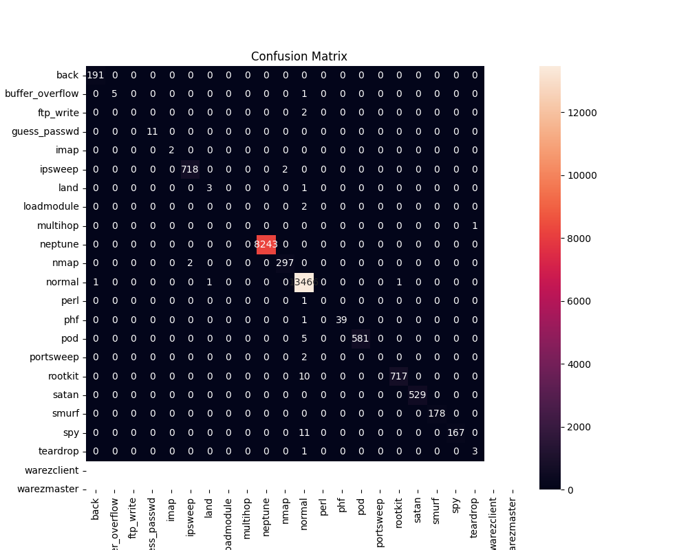
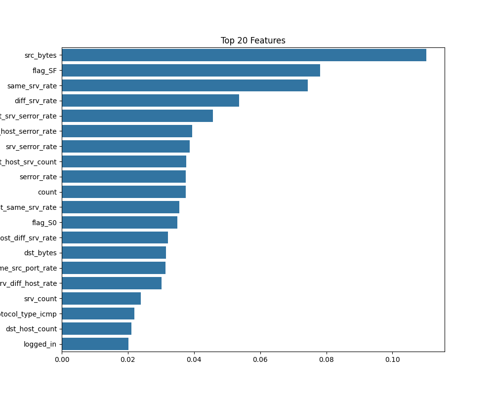
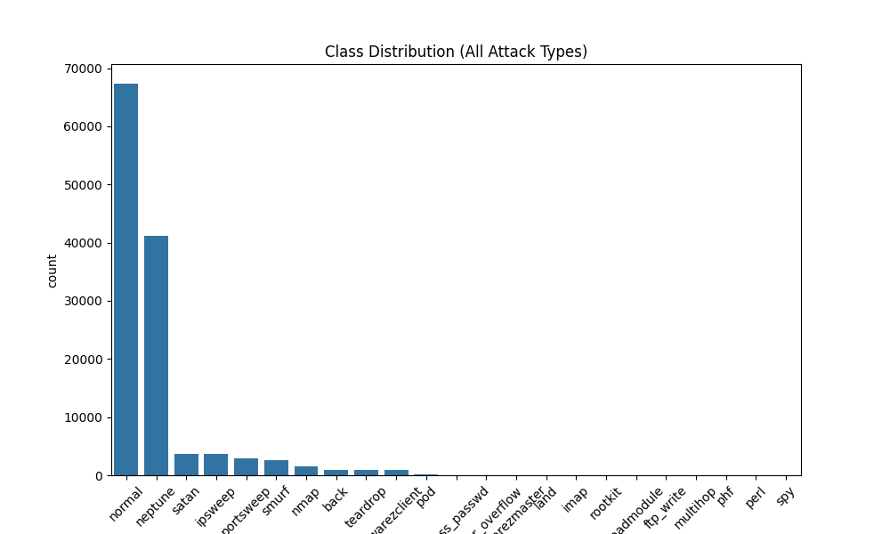
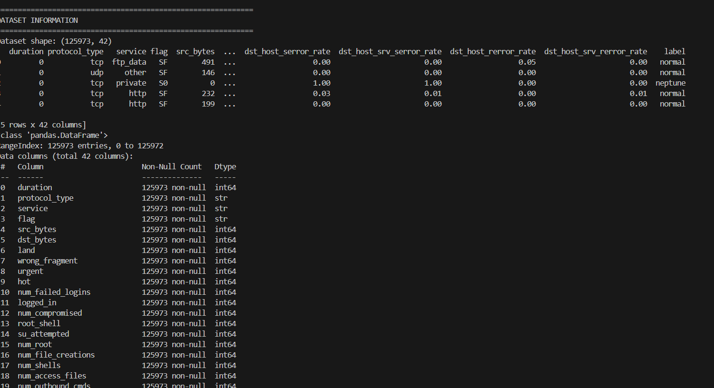
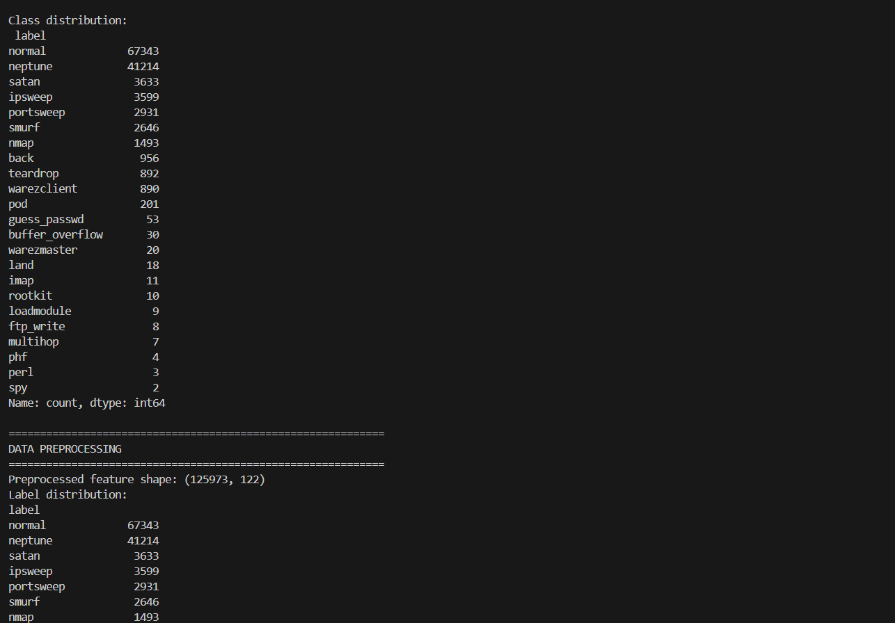
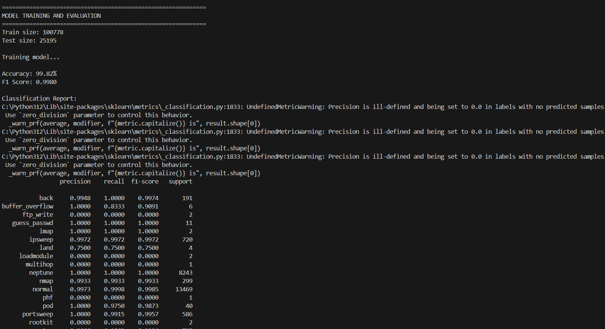
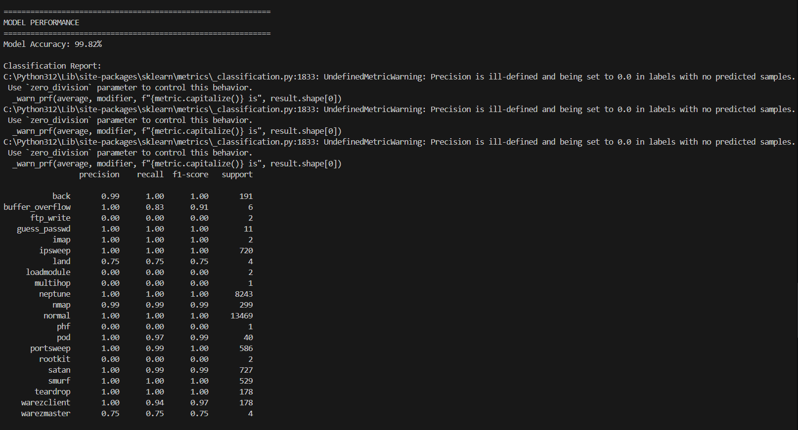
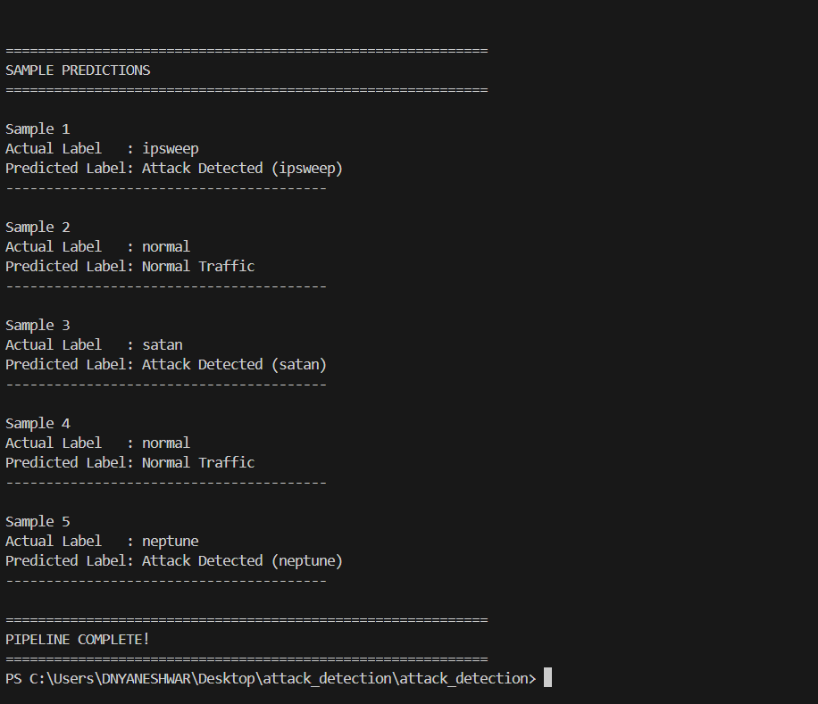

# Attack Detection System using Machine Learning

## Project Overview
This project is a Machine Learning-based Intrusion Detection System (IDS) that detects whether network traffic is Normal or an Attack. The model is trained using the KDD Cup 99 dataset and uses the Random Forest algorithm for attack detection.

## Objective
The objective of this project is to build a system that can detect network intrusions using Machine Learning and classify network traffic as Normal or Malicious.

## Technologies Used
- Python
- Pandas
- NumPy
- Scikit-learn
- Matplotlib
- Joblib

## Project Structure
Attack-Detection-ML
│
├── dataset        -> Contains training and testing dataset
├── src            -> Source code files
├── model          -> Saved trained model
├── outputs        -> Output graphs
├── main.py        -> Main program
├── requirements.txt
└── README.md

## Project Workflow
1. Load KDD Dataset
2. Data Preprocessing
3. Feature Encoding
4. Train Test Split
5. Model Training (Random Forest)
6. Model Evaluation
7. Attack Prediction
8. Visualization (Confusion Matrix, Feature Importance)

## Model Performance
- Algorithm Used: Random Forest
- Accuracy: 99.82%
- F1 Score: 0.9980
- Cross Validation Score: 0.9978

## Output Screenshots

### Confusion Matrix

### Feature Importance

### Class Distribution

## Project Execution Screenshots

* Dataset Information

* Data Preprocessing and Class Distribution

* Model Training

* Model Performance

* Sample Prediction

The model predicts whether the network traffic is normal or an attack and also identifies the type of attack such as DoS, Probe, R2L, and U2R.

## How to Run the Project
1. Install Python
2. Install required libraries:
   pip install -r requirements.txt
3. Run the project:
   python main.py

## Dataset
KDD Intrusion Detection Dataset

## Conclusion
This project shows how Machine Learning can be used in Cyber Security to detect network attacks and improve security monitoring systems.

## Author
Dnyaneshwar Padol
